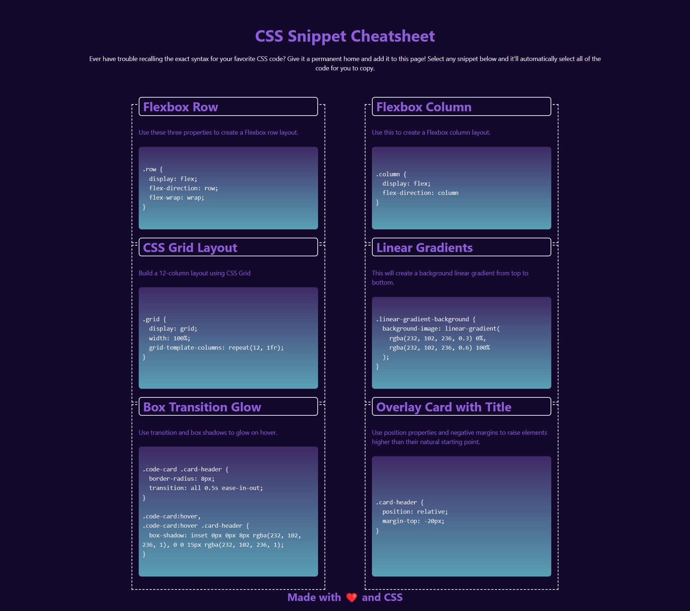

# module-two-miniproject

## Description
CSS Snippet Cheatsheet

## Credit
The starter code belongs to UT coding bootcamp.
(I added more comments to understand the logic of the used code and changed few colors to see how css variables work)

## Usage
